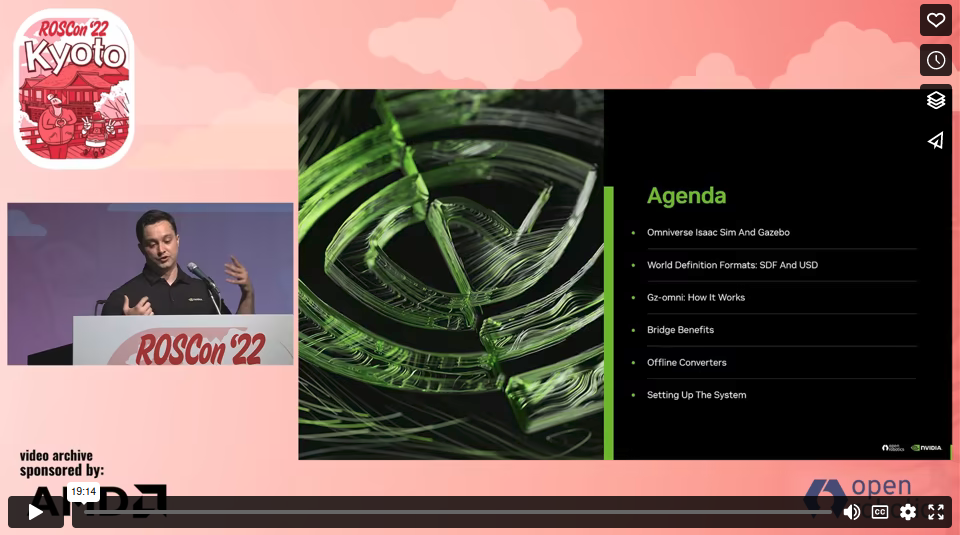

# gz-usd | SDF <-> USD converter

USD is a high-performance extensible software platform for collaboratively constructing animated 3D
scenes, designed to meet the needs of large-scale film and visual effects production.

This repo provides tools to convert between SDF and USD files.

> [!CAUTION]
> This converter has been only tested on Ubuntu 20.04. It is expected to work as well on Ubuntu 22.04
**USD requires CMAKE 3.12; this package is available from Ubuntu 20.04**

## Tutorials

If you have already installed `gz-usd` you might want to visit [the tutorial section](./tutorials/README.md).

## Requirements

You will need all of the dependencies for sdformat, along with the following additional dependencies

| System  | Version |
| ------------- | ------------- |
| Ubuntu | 20.04 (Focal Fossa) |
| Gazebo | Garden |
| Cmake | >=3.12 |
| OpenUSD | v21.11 |

Here you have more detailed instructions about how to setup your environment.

* [Gazebo Garden](https://gazebosim.org/docs/garden/install_ubuntu):

> [!NOTE]  
> You can follow the [official instructions](https://gazebosim.org/docs/garden/install_ubuntu) as well.

1. Install some necessary tools
    ```bash
    $ sudo apt-get update
    $ sudo apt-get install lsb-release wget gnupg
    ```

2. Install Gazebo Garden
    ```bash
    $ sudo wget https://packages.osrfoundation.org/gazebo.gpg -O /usr/share/keyrings/pkgs-osrf-archive-keyring.gpg
    $ echo "deb [arch=$(dpkg --print-architecture) signed-by=/usr/share/keyrings/pkgs-osrf-archive-keyring.gpg] http://packages.osrfoundation.org/gazebo/ubuntu-stable $(lsb_release -cs) main" | sudo tee /etc/apt/sources.list.d/gazebo-stable.list > /dev/null
    $ sudo apt-get update
    $ sudo apt-get install gz-garden
    ```

* [OpenUSD](https://github.com/PixarAnimationStudios/OpenUSD/releases/tag/v21.11):

> [!IMPORTANT]  
> USD requires at least CMAKE 3.12 to compile it.

> [!NOTE]  
> You can follow the [official instructions](https://github.com/PixarAnimationStudios/OpenUSD/tree/v21.11#getting-and-building-the-code) as well.

1. Clone the USD repository
    ```bash
    $ git clone --depth 1 -b v21.11 https://github.com/PixarAnimationStudios/OpenUSD
    ```

2. Install dependencies to compile OpenUSD

    ```bash
    $ sudo apt install -y python3-opengl cmake libglu1-mesa-dev freeglut3-dev mesa-common-dev
    $ python3 -m pip install pyside2
    ```
3. Use the build script to compile USD.

> [!TIP]  
> In order to speed up compilation, it is recommended to disable unneeded components.

    ```bash
    $ python3 OpenUSD/build_scripts/build_usd.py --build-variant release --no-tests --no-examples --no-tutorials --no-docs --no-python -j$(($(grep -c "^processor" /proc/cpuinfo) - 1)) <install_dir>
    ```
> [!NOTE]  
> If your system collapses during compilation, try reducing the number of cores in the `-j/--jobs` flag.

4. Add USD to system paths `~/.bashrc` (replace <install_dir> with the path to your USD install directory).

    ```bash
    export PATH=<install_dir>/bin${PATH:+:${PATH}}
    export LD_LIBRARY_PATH=<install_dir>/lib${LD_LIBRARY_PATH:+:${LD_LIBRARY_PATH}}
    export CMAKE_PREFIX_PATH=<install_dir>${CMAKE_PREFIX_PATH:+:${CMAKE_PREFIX_PATH}}
    export PYTHONPATH=<install_dir>/lib/python${PYTHONPATH:+:${PYTHONPATH}}
    ```

5. Reaload your envirment to reflec the changes.

    ```bash
    $ source ~/.bashrc
    ```

* [gz-usd](#Setup)

## Setup

Follow the steps below in order to build `gz-usd` by traditional cmake build.

> [!NOTE]  
> Be sure to build gz-usd on a terminal with the above environment variables exported.

1. Clone the gz-usd repository.
    ```bash
    $ git clone https://github.com/MrKeith99/gz-usd
    ```

2. Change directory.
    ```bash
    $ cd gz-usd
    ```

3. Create a `build` folder.
    ```bash
    $ mkdir build
    ```

4. Change directory.
    ```bash
    $ cd build
    ```

5. Setup the compiler.
    ```bash
    $ cmake ..
    ```

    6. Start the compiler.
    ```bash
    $ make
    ```


You can also build `gz-usd`with [colcon]([https://colcon.readthedocs.io/en/released/index.html](https://colcon.readthedocs.io/en/released/user/installation.html#using-pip-on-any-platform)):

> [!NOTE]  
> You can use the `pip` installation method to avoid any installation problems.

1. Clone the gz-usd repository.
    ```bash
    $ git clone https://github.com/MrKeith99/gz-usd
    ```

2. Change directory.
    ```bash
    $ cd gz-usd
    ```

3. Start the compiler.
    ```bash
    $ colcon build
    ```

## Usage

You should now have an executable named `sdf2usd` and `usd2sdf` in the `<install_dir>/build/bin` directory.
These executable can be used to convert a SDF world file to a USD file and viceversa.
To see how the executable works, run the following command from the `<install_dir>/build/bin` directory:

1. Change directory.
    ```bash
    $ cd <install_dir>/build/bin
    # if colcon: cd <install_dir>/build/gz-usd0/bin
    ```

2. Check how to use the command with `--help` flag.
    ```bash
    $ ./sdf2usd -h
    # or: ./usd2sdf -h
    ```
    
> [!NOTE]  
> To understand better how to use each command, please visit [the tutorial section](./tutorials/README.md).

### ROSCon 2022

[](https://vimeo.com/767140085)
